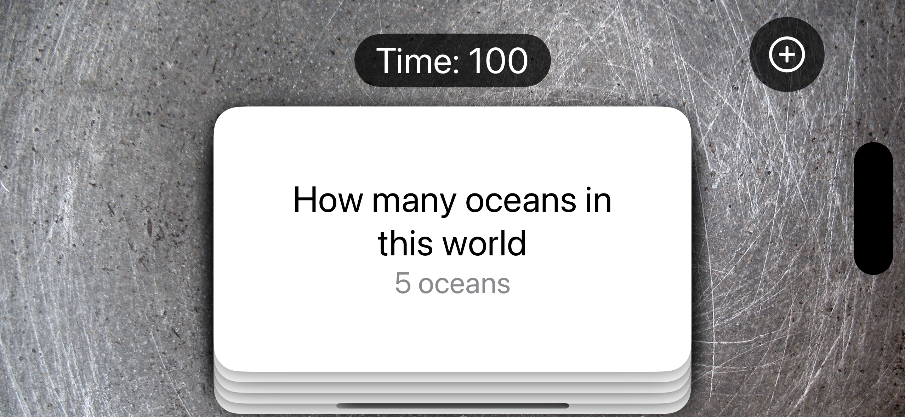
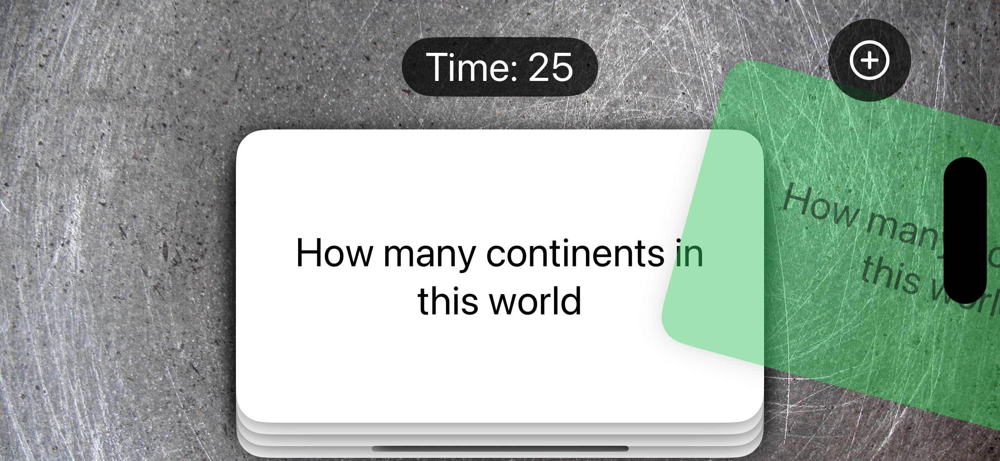
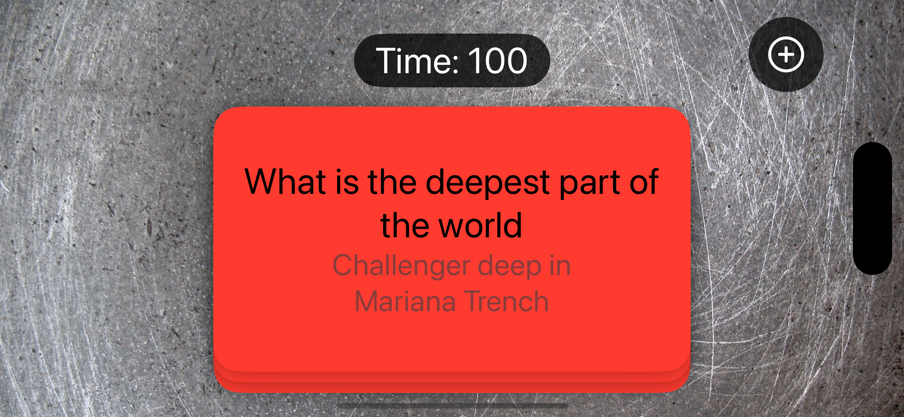
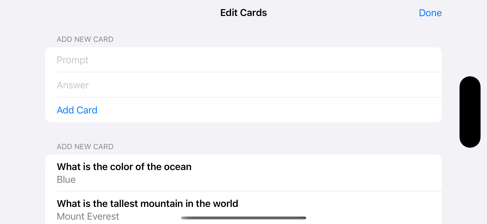
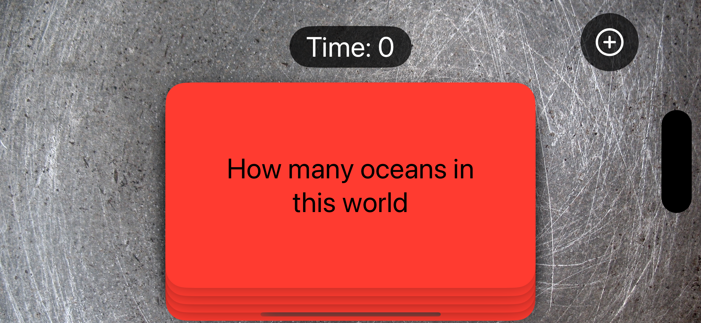

# Flashzilla  
This is a basic learning project to create an app that helps users learn using digital flashcards. Each flashcard contains a question and an answer or explanation that appears when tapped. The app also features a timer, card swiping for review, and a mechanism to repeat incorrect answers for better learning.

---  
The source learning is from 17th project of the course "100 Days of SwiftUI" (https://www.hackingwithswift.com/100/swiftui)  

---  
## Goals  
1. Display a main page showing:  
   - A flashcard with a question and answer.  
   - A button to add new flashcards.  
   - A timer that restricts card swiping when it runs out.  

2. Allow users to:  
   - Tap a flashcard to reveal the answer.  
   - Swipe right if the answer is correct, turning the card green and removing it from the stack.  
   - Swipe left if the answer is incorrect, turning the card red and returning it to the stack as the last card.  

3. Provide functionality to add new flashcards to the deck easily.  

4. Include a timer to manage study sessions, locking swiping when time runs out for focused review.  

5. Create an intuitive and engaging interface for efficient flashcard-based learning.  

---
# Flashzilla – Image Comments Feature

---

